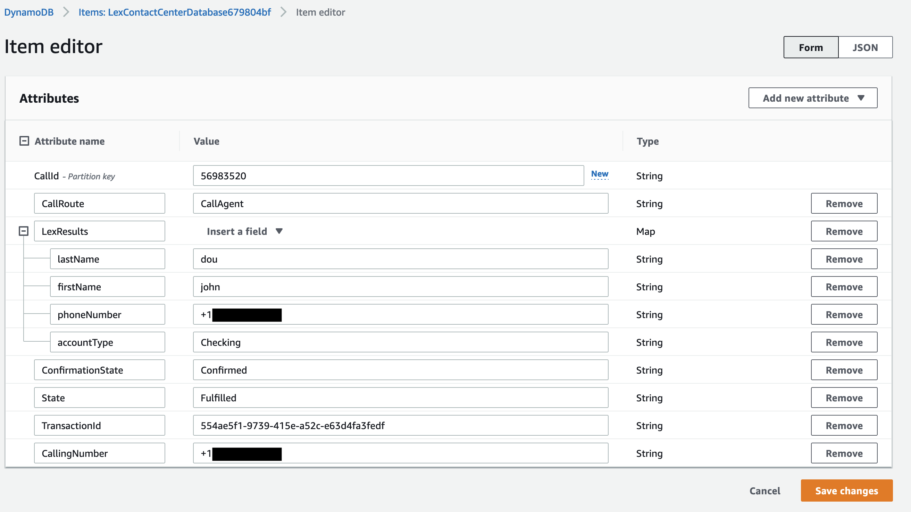

## Amazon Chime SDK With Amazon Lex Bot for Existing Contact Centers - Contact Center Intelligence

## Overview


This will demonstrate how you can add an Amazon Lex Bot to an existing Contact Center. In this example, an Amazon Chime Voice Connector will be used to deliver PSTN calls but any carrier can be used in your environment.

## How It Works

### Inbound Call from PSTN

After deploying the CDK, a phone number and `aws ssm` command will be provided to you:

```
Outputs:
LexContactCenter.ssmCommand = aws ssm start-session --target i-0c61c739c02359f9f
LexContactCenter.voiceConnectorPhone = +1NPANXXXXXX
```

You can optionally use the `aws ssm` command to connect to the Asterisk server deployed as part of this demo. The `voiceConnectorPhone` provided is the number to dial to connect to the Amazon Lex bot through the Asterisk server. Dial that number from any PSTN based phone to test the demo.

The first portion of this call flow is a call from the PSTN. This call will be answered by an Asterisk PBX. In your environment this could be some combination of an SBC and Contact Center.

```sip
INVITE sip:+1NPANXXXXXX@54.225.191.168:5060;transport=UDP SIP/2.0
Via: SIP/2.0/UDP 3.80.16.132:5060;branch=z9hG4bK980f.18c7e855b3ca2c197661a8838c65c32d.0
From: <sip:+1NPANXXXXXX@10.0.127.102:5060>;tag=4XU48Ua5NDrcr
To: <sip:+1NPANXXXXXX@54.225.191.168:5060>;transport=UDP
X-VoiceConnector-ID: bxhrxku1lu5jcu0roa4ca7
```

This Asterisk will then route the call to an Amazon Chime Voice Connector via SIP. An extra header has been added that will be used to correlate the call through the different components.

```sip
INVITE sip:+18005551212@do7wjdbi641ffigpabxkfr.voiceconnector.chime.aws SIP/2.0
Via: SIP/2.0/UDP 54.225.191.168:5060;rport;branch=z9hG4bKPj3f8527cb-1f02-4721-9c5c-ec38479ed46b
From: <sip:+1NPANXXXXXX@10.0.0.141>;tag=d489c3f5-bebc-4785-afc9-a12f0ed7cf5a
To: <sip:+18005551212@grrrp7d8qefmxe2jww7qb8.voiceconnector.chime.aws>
X-CallId: 66506309
```

In this example SIP INVITE from the Asterisk to the Amazon Chime Voice Connector, the original-calling-number is passed as the FROM number and a new number is used as the TO number. This number does not need to be a number in your Amazon Chime Phone Inventory. The X-CallId is added as a unique identifier for correlation purposes.

### Triggering the PSTN Audio

To deliver the call to the PSTN Audio via SIP, the call is sent to Amazon Chime Voice Connector. This Amazon Chime Voice Connector is configured as the Trigger Value for the SIP Rule.


This SIP Rule targets a SIP media application that is associated with an AWS Lambda that will be triggered when a call is made to that Amazon Chime Voice Connector. This is how a SIP call can be made from an existing Contact Center to an Amazon Chime PSTN Audio SIP media application.

### Using the PSTN Audio handler

The SIP media application handler Lambda will be invoked with an event similar to this:

```json
{
  "SchemaVersion": "1.0",
  "Sequence": 1,
  "InvocationEventType": "NEW_INBOUND_CALL",
  "CallDetails": {
    "TransactionId": "23fe0cf1-fc36-4bdc-976d-3520c0a3ac86",
    "AwsAccountId": "111122223333 ",
    "AwsRegion": "us-east-1",
    "SipRuleId": "3f5f6ec1-6004-494a-b514-1673d62cb8c5",
    "SipMediaApplicationId": "8a912ad2-67aa-4852-a892-34a454d370c7",
    "Participants": [
      {
        "CallId": "f06dd26d-fcaf-411e-9cdb-05ac726e1b9a",
        "ParticipantTag": "LEG-A",
        "To": "+18005551212",
        "From": "+1NPANXXXXXX",
        "Direction": "Inbound",
        "StartTimeInMilliseconds": "1648477951790",
        "SipHeaders": {
          "X-CallId": "66506309"
        }
      }
    ]
  }
}
```

This invocation is a `NEW_INBOUND_CALL` that contains the same `X-CallId` information that was sent to the Amazon Chime Voice Connector and will be used to store information in an Amazon DynamoDB table. Once the data has been stored, the Lambda will return a `StartBotConversation` action to the SIP media application.

[smaHandler.js](resources/smaHandler/smaHandler.js)

```javascript
exports.handler = async (event, context, callback) => {
  let actions;
  switch (event.InvocationEventType) {
    case 'NEW_INBOUND_CALL':
      console.log('NEW INBOUND CALL');
      await putInfo(event);
      actions = [startBotConversationAction];
      break;
```

The resulting `startBotConversationAction` sent to the SIP media application will look something like this:

```json
{
  "SchemaVersion": "1.0",
  "Actions": [
    {
      "Type": "StartBotConversation",
      "Parameters": {
        "BotAliasArn": "arn:aws:lex:us-east-1:111111111111:bot-alias/MJBJRG3FRF/TSTALIASID",
        "LocaleId": "en_US",
        "Configuration": {
          "SessionState": {
            "DialogAction": {
              "Type": "ElicitIntent"
            }
          },
          "WelcomeMessages": [
            {
              "ContentType": "PlainText",
              "Content": "Hi! I'm BB, the Banking Bot. How can I help you today?  You can check your account balances or transfer funds."
            }
          ]
        }
      }
    }
  ]
}
```

This will begin the conversation between the caller on the PSTN and the Amazon Lex Bot.

### Post Amazon Lex Processing

Once the conversation with the Amazon Lex Bot has completed, it will invoke the SIP media application Lambda with the full results of the Amazon Lex Bot conversation. Below is a trimmed example showing an `ACTION_SUCCESSFUL` invocation after a `StartBotConversation` action.

```json
{
  "SchemaVersion": "1.0",
  "Sequence": 2,
  "InvocationEventType": "ACTION_SUCCESSFUL",
  "ActionData": {
    "IntentResult": {
      "Interpretations": [
        {
          "NluConfidence": {
            "Score": 1
          },
          "Intent": {
            "Name": "TransferFunds",
            "Slots": {
              "transferAmount": {
                "Value": {
                  "OriginalValue": "one hundred",
                  "InterpretedValue": "100",
                  "ResolvedValues": ["100"]
                },
                "Values": []
              },
              "sourceAccountType": {
                "Value": {
                  "OriginalValue": "checking",
                  "InterpretedValue": "Checking",
                  "ResolvedValues": ["Checking"]
                },
                "Values": []
              },
              "targetAccountType": {
                "Value": {
                  "OriginalValue": "savings",
                  "InterpretedValue": "Savings",
                  "ResolvedValues": ["Savings"]
                },
                "Values": []
              }
            },
            "State": "Fulfilled",
            "ConfirmationState": "Confirmed"
          }
        }
      ]
    }
  },
  "CallDetails": {
    "TransactionId": "23fe0cf1-fc36-4bdc-976d-3520c0a3ac86",
    "AwsAccountId": "104621577074",
    "AwsRegion": "us-east-1",
    "SipRuleId": "3f5f6ec1-6004-494a-b514-1673d62cb8c5",
    "SipMediaApplicationId": "8a912ad2-67aa-4852-a892-34a454d370c7",
    "Participants": [
      {
        "CallId": "f06dd26d-fcaf-411e-9cdb-05ac726e1b9a",
        "ParticipantTag": "LEG-A",
        "To": "+18005551212",
        "From": "+1NPANXXXXXX",
        "Direction": "Inbound",
        "StartTimeInMilliseconds": "1648749429539",
        "Status": "Connected",
        "SipHeaders": {
          "X-CallId": "66506309"
        }
      }
    ]
  }
}
```

When this `ACTION_SUCCESSFUL` is received the Lambda handler will perform the following actions:

- Parse results
- Determine next call route action
- Store results in DyanmoDB table
- Return `hangupAction` to SIP media application

[smaHandler.js](resources/smaHandler/smaHandler.js)

```javascript
exports.handler = async (event, context, callback) => {
  let actions;
  switch (event.InvocationEventType) {
    case 'ACTION_SUCCESSFUL':
      console.log('ACTION SUCCESSFUL');
      await parseResult(event);
      actions = [hangupAction];
      break;
```

```javascript
if (
  event.ActionData.IntentResult.SessionState.Intent.Name === 'TransferFunds'
) {
  callRoute = 'CallAgent';
} else {
  callRoute = 'Disconnect';
}
```

The DynamoDB table will now look like this:


### Delivering to Agent

The `hangupAction` from the SIP media application returns the call to the Asterisk PBX. In this example, if the `TransferFunds` Intent is used, the call is sent to an Agent using a web client based SIP phone. This client will then query the DynamoDB table for the information captured from the Lex Bot. Your environment may have different devices and configurations. If the `CheckBalance` intent is used, the Asterisk PBX will Hangup the call.

[AsteriskConfiguration](resources/asteriskConfig/extensions.conf)

#### Call Routing

```asterisk
same => n,Set(CALL_ROUTE=${SHELL(curl --silent API_URLquery?xCallId=${CallId} | jq -r .CallRoute )})
same => n,NoOp(${CALL_ROUTE})
same => n,GotoIf($[${CALL_ROUTE} = CallAgent]?callAgent:disconnect)
```

The Intent that was used is determined by a query from the PBX to the DynamoDB where the call information was stored. In this example, if the caller used `CheckBalance`, that information would be stored in the DynamoDB by the smaHandler Lambda and the call would be disconnected. However, if the caller used `TransferFunds`, they would be connected to an Agent. This is an exmaple of how the Amazon Lex Bot can be used for deflection in the case of self-service and intelligent routing when required.

#### INVITE to Agent

```sip
INVITE sip:rm68qs0l@173.25.202.6:50131;transport=ws SIP/2.0
Via: SIP/2.0/WS 10.0.0.141:8088;rport;branch=z9hG4bKPjb2c966b1-bb9b-4951-982f-cdd820518f71;alias
From: <sip:+1NPANXXXXXX@ip-10-0-0-141.ec2.internal>;tag=e8a6c3dc-1c02-432c-8dc9-9c335867d4d9
To: <sip:rm68qs0l@173.25.202.6>
X-CallId: 66506309
```


When answered, the client will display the results of the query to the DynamoDB table that contains the information the caller gave to the Amazon Lex Bot.

[LexData.js](site/src/LexData.js)

```javascript
async function dataDipByXCallId(xCallId) {
  const queryResponse = await API.get('queryAPI', 'query', {
    queryStringParameters: {
      xCallId: xCallId,
    },
  });

  const completeResults = {
    ConfirmationState: queryResponse.ConfirmationState,
    CallingNumber: queryResponse.CallingNumber,
  };
  for (const [key, value] of Object.entries(queryResponse.LexResults)) {
    completeResults[key] = value;
  }
  setLexResults(completeResults);
}
```

## Components Deployed

- Amazon Chime Voice Connector - PSTN Access w/DID
- Amazon Chime Voice Connector - PSTN Audio
- AWS Lambda - SIP media application Handler
- AWS Lambda - Call Query
- Amazon API Gateway - Call Query
- Amazon Cognito UserPool
- AWS EC2 - Asterisk Server
- AWS DynamoDB - Call Info Table
- Amazon Lex Bot - Banker Bot Demo

## Deployment

### Requirements

- [Nodev12+](https://nodejs.org/en/download/) installed
- [yarn](https://yarnpkg.com/getting-started/install) installed
- AWS Account with approriate permissions
- [Service Quota](https://us-east-1.console.aws.amazon.com/servicequotas/home/services/chime/quotas) allowance for Phone Numbers

### Deployment

```
yarn launch
```

### Client

To use the included web client SIP phone:

```
cd site
yarn
yarn run start
```

This will start a local server that can be accessed at `http://localhost:3000`. You will need to create an account with Cognito using an email address before signing in. After the Amazon Lex Bot has processed the call will be sent to this phone and can be answered to establish two-way communication between the PSTN caller and the SIP agent.

### Cleanup

```
yarn destroy
```

## Notes

This demo is powered by Amazon Lex. Use of Amazon Lex is subject to the AWS Service Terms, including the terms specific to the AWS Machine Learning and Artificial Intelligence Services. Standard Amazon Lex charges apply. For more pricing information, please refer to [Amazon Lex streaming conversation pricing](https://aws.amazon.com/lex/pricing/).

Be sure to cleanup your deployment when finished as charges may apply for the resources deployed, and will continue to be charged if you do not remove them.
